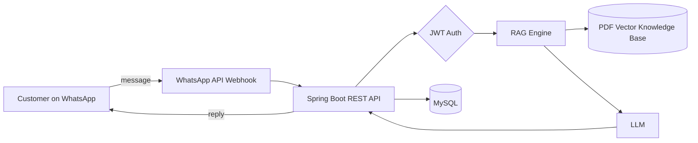
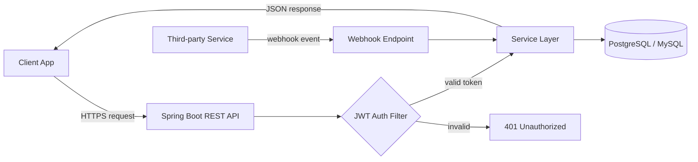
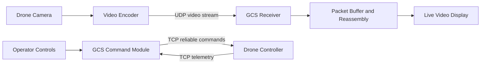

  

<h3 align="center">
  
</h3>

  
  
  

---

## ⚡ Recruiter TL;DR

| | |
|---|---|
| **Role** | Backend Developer Intern @ [Flowshipz](https://flowshipz.com) — Spring Boot REST APIs, PostgreSQL/MySQL schemas, JWT auth, webhooks |
| **Education** | B.Tech CSE, SRM Institute of Science & Technology (2024–2028) · **CGPA 8.9** |
| **Strengths** | Java · Spring Boot · REST API design · SQL · Concurrency · Socket networking · RAG pipelines |
| **Proof** | 🏆 **SIH Top 8 Finalist** (180+ teams) · 🥈 Technova 2026 National Finalist · 🧩 200+ LeetCode / NeetCode problems |
| **Looking for** | Backend / SDE internships & full-time roles |

> 💡 *"APIs & clean architecture > AI hype. Get the fundamentals right."*

---

## 🛠️ Tech Stack

**Backend** &nbsp;

**Databases** &nbsp;

**Frontend** &nbsp;

**Tools** &nbsp;

---

## 🚀 Flagship Project

### 🤖 supportlyAi — RAG Customer Support & WhatsApp Automation Platform
**Problem:** Small businesses answer the same customer questions on WhatsApp all day.
**Solution:** Upload a PDF knowledge base → the platform answers customer queries automatically on WhatsApp using retrieval-augmented generation.

**Highlights:** Spring Boot REST APIs · JWT auth · PDF vector knowledge base · WhatsApp API integration · MySQL persistence
**Stack:** `Java` `Spring Boot` `RAG` `JWT` `MySQL`

---

## 🧱 More Projects

### 🏢 Flowshipz — Production Backend Services
**Problem:** The product needs secure, reliable APIs that talk to the frontend and to third-party services in real time.
**Solution:** Built and maintained Spring Boot REST APIs with JWT-secured endpoints, relational schemas and webhook handlers.

**Highlights:** REST API design · PostgreSQL/MySQL schema design · JWT authentication · Webhook integrations
**Stack:** `Java` `Spring Boot` `PostgreSQL` `MySQL` `JWT`

---

### 📡 An Intelligent Eye — Drone GCS
**Problem:** Live drone video drops frames and lags when the network is unreliable.
**Solution:** A custom Ground Control Station with low-level socket networking: UDP for the live video stream and TCP for reliable control commands, tuned to reduce packet loss.

**Highlights:** UDP/TCP socket protocols · Packet-loss mitigation for video · Custom Ground Control Station
**Stack:** `Java` `UDP/TCP Sockets` `Networking`

---

## 🏆 Achievements

- 🥇 **Smart India Hackathon — Top 8 Finalist** out of 180+ teams
- 🥈 **Technova 2026 — National Finalist**
- 🧩 **200+ problems** solved on LeetCode / NeetCode
- 🎓 **CGPA 8.9** at SRMIST

---

## 📊 GitHub Stats

  
  

---

## 🌱 Currently

- 🔨 Building **supportlyAi** — RAG + WhatsApp automation
- 📚 Learning **distributed systems design** & advanced DSA
- 🔭 Exploring **microservices**, caching and message queues

---

### 🤝 Let's build something solid.

**Open to backend / SDE roles** · [Email](mailto:shvmnath.monk@gmail.com) · [LinkedIn](https://www.linkedin.com/in/shivam-goswami-88633124a/) · [Portfolio](https://shvmmonk.vercel.app)

